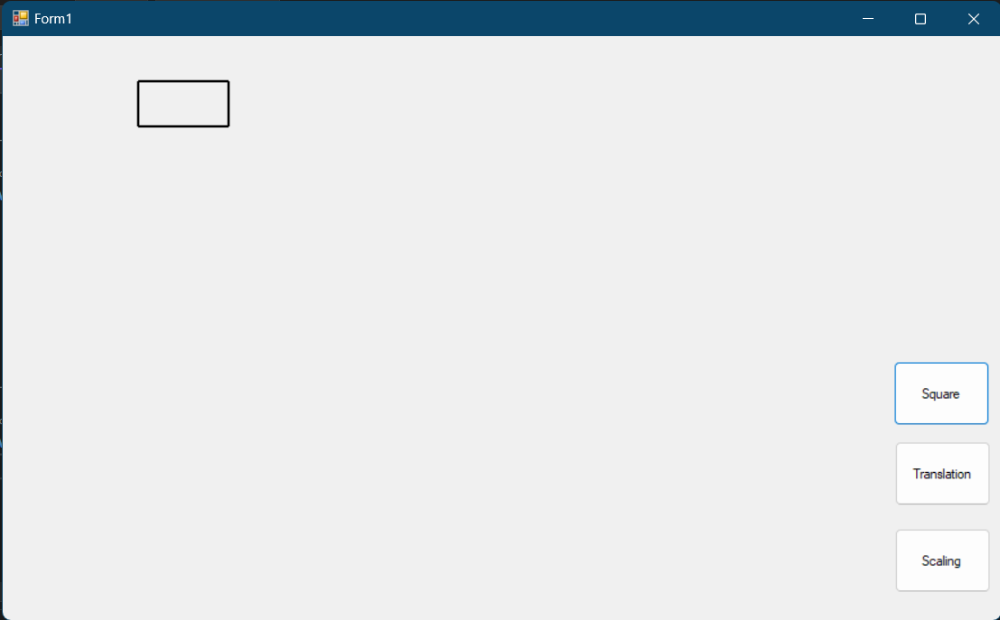
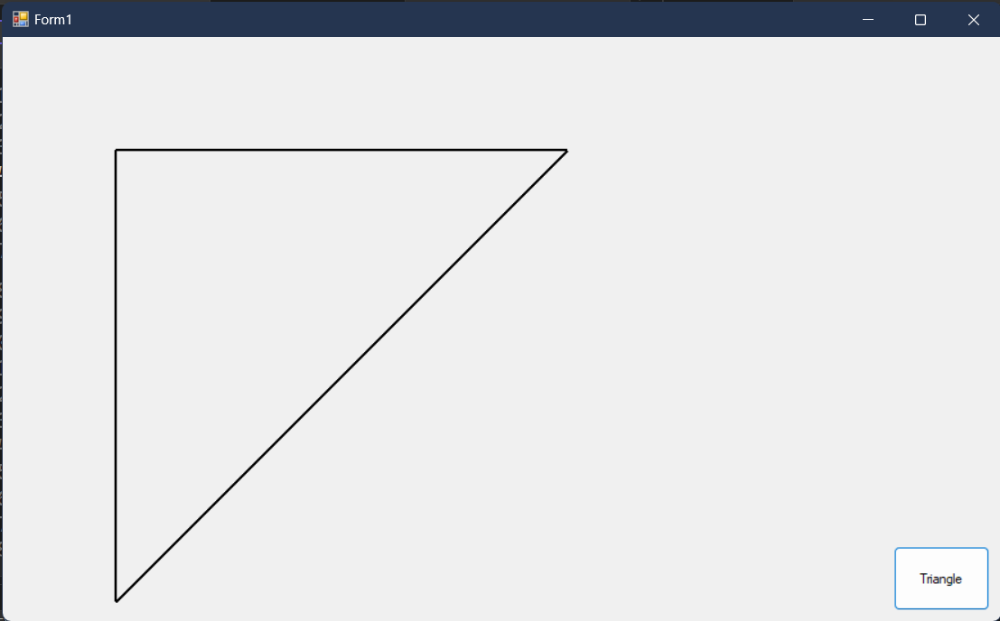
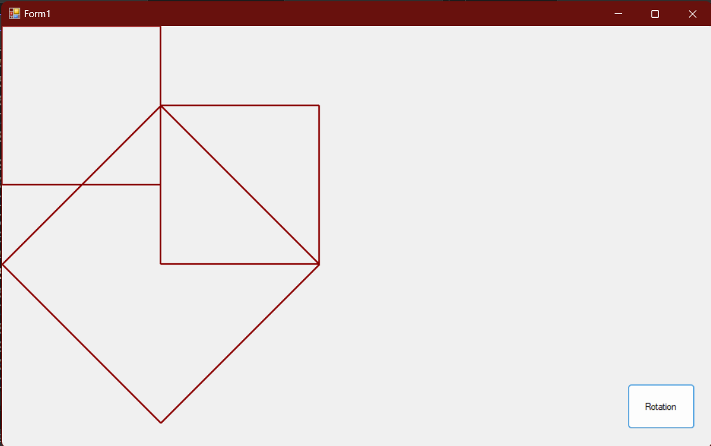
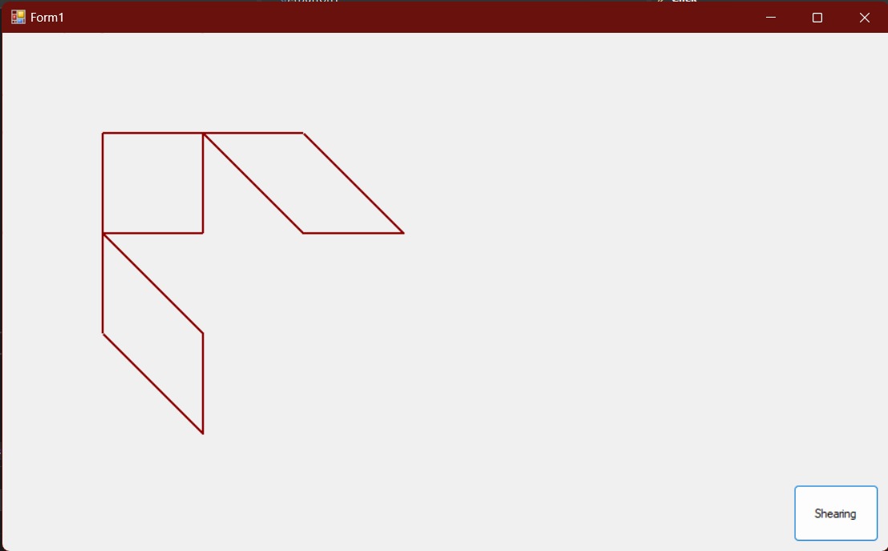

# Graphics

## 1- Draw Line by DDA in Form

---


```vbnet
Public Class Form1
    Dim i As Integer
    Private Sub Button1_Click(sender As Object, e As EventArgs) Handles Button1.Click
        Dim x1 As Integer, y1 As Integer
        Dim x2 As Integer, y2 As Integer

        x1 = TextBox1.Text
        y1 = TextBox2.Text
        x2 = TextBox3.Text
        y2 = TextBox4.Text

        dda(x1, y1, x2, y2)

    End Sub

    Public Sub dda(x1 As Integer, y1 As Integer, x2 As Integer, y2 As Integer)
        Dim length As Integer
        Dim dx As Double, dy As Double
        Dim x As Double , y As Double 
        Dim x_temp = x
        Dim y_temp = y

        Dim g As Graphics = Me.CreateGraphics()
        Dim mypen As New Pen(Color.Black, 2)

        If Math.Abs(x2 - x1) > Math.Abs(y2 - y1) Then
            length = Math.Abs(x2 - x1)
        Else
            length = Math.Abs(y2 - y1)
        End If

        dx = (x2 - x1) / length
        dy = (y2 - y1) / length

        x = x1 + 0.5 * sign_fun(x2 - x1)
        y = y1 + 0.5 * sign_fun(y2 - y1)
        x_temp = x
        y_temp = y
        For Me.i = 1 To length
            x = x + dx
            y = y + dy
            g.DrawLine(mypen, CInt(x_temp), CInt(y_temp), CInt(x), CInt(y))

            x_temp = x
            y_temp = y
        Next
    End Sub

    Public Function sign_fun(ByRef d As Integer) As Integer
        Dim k As Integer
        If d > 0 Then k = 1
        If d = 0 Then k = 0
        If d < 0 Then k = -1

        sign_fun = k
    End Function

End Class

```

---

## 2- Draw Line by DDA in Picture Box

---


```vbnet
Public Class Form1
    Dim i As Integer
    Private Sub Button1_Click(sender As Object, e As EventArgs) Handles Button1.Click
        Dim x1 As Integer, y1 As Integer
        Dim x2 As Integer, y2 As Integer

        x1 = TextBox1.Text
        y1 = TextBox2.Text
        x2 = TextBox3.Text
        y2 = TextBox4.Text

        dda(x1, y1, x2, y2)

    End Sub

    Public Sub dda(x1 As Integer, y1 As Integer, x2 As Integer, y2 As Integer)
        Dim length As Integer
        Dim dx As Double, dy As Double
        Dim x As Double , y As Double 
        Dim x_temp = x
        Dim y_temp = y

        Dim g As Graphics = PictureBox1.CreateGraphics()
        Dim mypen As New Pen(Color.Black, 2)

        If Math.Abs(x2 - x1) > Math.Abs(y2 - y1) Then
            length = Math.Abs(x2 - x1)
        Else
            length = Math.Abs(y2 - y1)
        End If

        dx = (x2 - x1) / length
        dy = (y2 - y1) / length

        x = x1 + 0.5 * sign_fun(x2 - x1)
        y = y1 + 0.5 * sign_fun(y2 - y1)
        x_temp = x
        y_temp = y
        For Me.i = 1 To length
            x = x + dx
            y = y + dy
            g.DrawLine(mypen, CInt(x_temp), CInt(y_temp), CInt(x), CInt(y))

            x_temp = x
            y_temp = y
        Next
    End Sub

    Public Function sign_fun(ByRef d As Integer) As Integer
        Dim k As Integer
        If d > 0 Then k = 1
        If d = 0 Then k = 0
        If d < 0 Then k = -1

        sign_fun = k
    End Function

End Class

```

---

## 3- Draw square by DDA and Translation and scaling

---

- Draw square


---

- Translation square


---

- scaling square


```vbnet
Public Class Form1
    Dim length As Integer
    Dim dx As Double, dy As Double
    Dim x As Double, y As Double
    Dim x_temp
    Dim y_temp
    Dim i As Integer
    Private Sub Button1_Click(sender As Object, e As EventArgs) Handles Button1.Click
        'Draw Square

        dda(120, 40, 120, 80)
        dda(120, 80, 200, 80)
        dda(200, 80, 200, 40)
        dda(200, 40, 120, 40)
    End Sub

    Private Sub Button2_Click(sender As Object, e As EventArgs) Handles Button2.Click
        'Translation Square

        dda(120 + 10, 80 + 10, 120 + 10, 40 + 10)
        dda(120 + 10, 80 + 10, 200 + 10, 80 + 10)
        dda(200 + 10, 40 + 10, 120 + 10, 40 + 10)
        dda(200 + 10, 80 + 10, 200 + 10, 40 + 10)
    End Sub

    Private Sub Button3_Click(sender As Object, e As EventArgs) Handles Button3.Click
        'Scaling Square مع عدم الحفاظ على الموقع الاصلي

        dda(120 * 2, 80 * 2, 120 * 2, 40 * 2)
        dda(120 * 2, 80 * 2, 200 * 2, 80 * 2)
        dda(200 * 2, 40 * 2, 120 * 2, 40 * 2)
        dda(200 * 2, 80 * 2, 200 * 2, 40 * 2)
    End Sub

    Public Sub dda(x1 As Integer, y1 As Integer, x2 As Integer, y2 As Integer)
        Dim g As Graphics = Me.CreateGraphics()
        Dim mypen As New Pen(Color.Black, 2)

        If Math.Abs(x2 - x1) > Math.Abs(y2 - y1) Then
            length = Math.Abs(x2 - x1)
        Else
            length = Math.Abs(y2 - y1)
        End If

        dx = (x2 - x1) / length
        dy = (y2 - y1) / length

        x = x1 + 0.5 * sign_fun(x2 - x1)
        y = y1 + 0.5 * sign_fun(y2 - y1)
        x_temp = x
        y_temp = y
        For Me.i = 1 To length
            x = x + dx
            y = y + dy

            g.DrawLine(mypen, CInt(x_temp), CInt(y_temp), CInt(x), CInt(y))

            x_temp = x
            y_temp = y
        Next

    End Sub

    Public Function sign_fun(ByRef d As Integer) As Integer
        Dim k As Integer
        If d > 0 Then k = 1
        If d = 0 Then k = 0
        If d < 0 Then k = -1

        sign_fun = k
    End Function
End Class

```

---

## 4- Scaling square with back original point

---


```vbnet
Public Class Form1
    Dim length As Integer
    Dim dx As Double, dy As Double
    Dim x As Integer, y As Integer
    Dim x_temp
    Dim y_temp
    Dim i As Integer
    Private Sub Button1_Click(sender As Object, e As EventArgs) Handles Button1.Click

        Dim x1 As Integer, y1 As Integer, x2 As Integer, y2 As Integer, x7 As Integer, y7 As Integer
        Dim x3 As Integer, y3 As Integer, x4 As Integer, y4 As Integer

        'original
        x1 = 120
        y1 = 40

        x7 = x1
        y7 = y1

        x2 = 120
        y2 = 80

        x3 = 200
        y3 = 80

        x4 = 200
        y4 = 40

        dda(x1, y1, x2, y2)
        dda(x1, y1, x3, y3)
        dda(x2, y2, x4, y4)
        dda(x3, y3, x4, y4)
        '==================================
        'sub
        x1 = x1 - x7
        y1 = y1 - y7

        x2 = x2 - x7
        y2 = y2 - y7

        x3 = x3 - x7
        y3 = y3 - y7

        x4 = x4 - x7
        y4 = y4 - y7

        dda(x1, y1, x2, y2)
        dda(x1, y1, x3, y3)
        dda(x2, y2, x4, y4)
        dda(x3, y3, x4, y4)

        '==================================
        'Scale
        x1 = x1 * 2
        y1 = y1 * 2

        x2 = x2 * 2
        y2 = y2 * 2

        x3 = x3 * 2
        y3 = y3 * 2

        x4 = x4 * 2
        y4 = y4 * 2

        dda(x1, y1, x2, y2)
        dda(x1, y1, x3, y3)
        dda(x2, y2, x4, y4)
        dda(x3, y3, x4, y4)
        '==================================
        'back to point
        x1 = x1 + x7
        y1 = y1 + y7

        x2 = x2 + x7
        y2 = y2 + y7

        x3 = x3 + x7
        y3 = y3 + y7

        x4 = x4 + x7
        y4 = y4 + y7


        dda(x1, y1, x2, y2)
        dda(x1, y1, x3, y3)
        dda(x2, y2, x4, y4)
        dda(x3, y3, x4, y4)
    End Sub

    Public Sub dda(x1 As Integer, y1 As Integer, x2 As Integer, y2 As Integer)
        Dim g As Graphics = Me.CreateGraphics()
        Dim mypen As New Pen(Color.DarkRed, 2)

        If Math.Abs(x2 - x1) > Math.Abs(y2 - y1) Then
            length = Math.Abs(x2 - x1)
        Else
            length = Math.Abs(y2 - y1)
        End If

        dx = (x2 - x1) / length
        dy = (y2 - y1) / length

        x = x1 + 0.5 * sign_fun(x2 - x1)
        y = y1 + 0.5 * sign_fun(y2 - y1)
        x_temp = x
        y_temp = y
        For Me.i = 1 To length
            x = x + dx
            y = y + dy

            g.DrawLine(mypen, CInt(x_temp), CInt(y_temp), CInt(x), CInt(y))

            x_temp = x
            y_temp = y
        Next

    End Sub

    Public Function sign_fun(ByRef d As Integer) As Integer
        Dim k As Integer
        If d > 0 Then k = 1
        If d = 0 Then k = 0
        If d < 0 Then k = -1

        sign_fun = k
    End Function

End Class


```

---

## 5- Draw Triangle

---



```vbnet
Public Class Form1
    Dim length As Integer
    Dim dx As Double, dy As Double
    Dim x As Double, y As Double
    Dim x_temp
    Dim y_temp
    Dim i As Integer
    Private Sub Button1_Click(sender As Object, e As EventArgs) Handles Button1.Click
        Dim x1 As Integer, y1 As Integer, x2 As Integer, y2 As Integer
        Dim x3 As Integer, y3 As Integer

        'original
        x1 = 100
        y1 = 100

        x2 = 500
        y2 = 100

        x3 = 100
        y3 = 500


        dda(x1, y1, x2, y2)
        dda(x1, y1, x3, y3)
        dda(x2, y2, x3, y3)
    End Sub

    Public Sub dda(x1 As Integer, y1 As Integer, x2 As Integer, y2 As Integer)
        Dim g As Graphics = Me.CreateGraphics()
        Dim mypen As New Pen(Color.Black, 2)

        If Math.Abs(x2 - x1) > Math.Abs(y2 - y1) Then
            length = Math.Abs(x2 - x1)
        Else
            length = Math.Abs(y2 - y1)
        End If

        dx = (x2 - x1) / length
        dy = (y2 - y1) / length

        x = x1 + 0.5 * sign_fun(x2 - x1)
        y = y1 + 0.5 * sign_fun(y2 - y1)
        x_temp = x
        y_temp = y
        For Me.i = 1 To length
            x = x + dx
            y = y + dy

            g.DrawLine(mypen, CInt(x_temp), CInt(y_temp), CInt(x), CInt(y))

            x_temp = x
            y_temp = y
        Next

    End Sub

    Public Function sign_fun(ByRef d As Integer) As Integer
        Dim k As Integer
        If d > 0 Then k = 1
        If d = 0 Then k = 0
        If d < 0 Then k = -1

        sign_fun = k
    End Function
End Class

```

---

## 6- Rotation

---



```vbnet
Public Class Form1
    Dim length As Integer
    Dim dx As Double, dy As Double
    Dim x As Double, y As Double
    Dim x_temp
    Dim y_temp
    Dim i As Integer, j As Integer, k As Integer

    Private Sub Button1_Click(sender As Object, e As EventArgs) Handles Button1.Click
        Dim p(4, 3) As Integer, r(3, 3) As Integer, pr(4, 3) As Integer
        Dim m As Integer
        Dim sx As Integer, sy As Integer

        sx = 200
        sy = 100


        p(0, 0) = 200 : p(0, 1) = 100 : p(0, 2) = 1
        p(1, 0) = 400 : p(1, 1) = 100 : p(1, 2) = 1
        p(2, 0) = 200 : p(2, 1) = 300 : p(2, 2) = 1
        p(3, 0) = 400 : p(3, 1) = 300 : p(3, 2) = 1

        dda(p(0, 0), p(0, 1), p(2, 0), p(2, 1))
        dda(p(0, 0), p(0, 1), p(1, 0), p(1, 1))
        dda(p(1, 0), p(1, 1), p(3, 0), p(3, 1))
        dda(p(2, 0), p(2, 1), p(3, 0), p(3, 1))

        r(0, 0) = 1 : r(0, 1) = 1 : r(0, 2) = 0
        r(1, 0) = -1 : r(1, 1) = 1 : r(1, 2) = 0
        r(2, 0) = 0 : r(2, 1) = 0 : r(2, 2) = 1


        p(0, 0) = p(0, 0) - sx : p(0, 1) = p(0, 1) - sy
        p(1, 0) = p(1, 0) - sx : p(1, 1) = p(1, 1) - sy
        p(2, 0) = p(2, 0) - sx : p(2, 1) = p(2, 1) - sy
        p(3, 0) = p(3, 0) - sx : p(3, 1) = p(3, 1) - sy


        dda(p(0, 0), p(0, 1), p(2, 0), p(2, 1))
        dda(p(0, 0), p(0, 1), p(1, 0), p(1, 1))
        dda(p(1, 0), p(1, 1), p(3, 0), p(3, 1))
        dda(p(2, 0), p(2, 1), p(3, 0), p(3, 1))

        For Me.i = 0 To 3
            For Me.j = 0 To 2
                m = 0
                For Me.k = 0 To 2
                    m = m + p(i, k) * r(k, j)
                Next
                pr(i, j) = m
            Next
        Next

        pr(0, 0) = pr(0, 0) + sx : pr(0, 1) = pr(0, 1) + sy
        pr(1, 0) = pr(1, 0) + sx : pr(1, 1) = pr(1, 1) + sy
        pr(2, 0) = pr(2, 0) + sx : pr(2, 1) = pr(2, 1) + sy
        pr(3, 0) = pr(3, 0) + sx : pr(3, 1) = pr(3, 1) + sy

        dda(pr(0, 0), pr(0, 1), pr(2, 0), pr(2, 1))
        dda(pr(0, 0), pr(0, 1), pr(1, 0), pr(1, 1))
        dda(pr(1, 0), pr(1, 1), pr(3, 0), pr(3, 1))
        dda(pr(2, 0), pr(2, 1), pr(3, 0), pr(3, 1))
    End Sub

    Public Sub dda(x1 As Integer, y1 As Integer, x2 As Integer, y2 As Integer)
        Dim g As Graphics = Me.CreateGraphics()
        Dim mypen As New Pen(Color.DarkRed, 2)

        If Math.Abs(x2 - x1) > Math.Abs(y2 - y1) Then
            length = Math.Abs(x2 - x1)
        Else
            length = Math.Abs(y2 - y1)
        End If

        dx = (x2 - x1) / length
        dy = (y2 - y1) / length

        x = x1 + 0.5 * sign_fun(x2 - x1)
        y = y1 + 0.5 * sign_fun(y2 - y1)
        x_temp = x
        y_temp = y
        For Me.i = 1 To length
            x = x + dx
            y = y + dy

            g.DrawLine(mypen, CInt(x_temp), CInt(y_temp), CInt(x), CInt(y))

            x_temp = x
            y_temp = y
        Next

    End Sub

    Public Function sign_fun(ByRef d As Integer) As Integer
        Dim k As Integer
        If d > 0 Then k = 1
        If d = 0 Then k = 0
        If d < 0 Then k = -1

        sign_fun = k
    End Function

End Class

```

---

## 7- Shearing

---



```vbnet
Public Class Form1
    Dim length As Integer
    Dim dx As Double, dy As Double
    Dim x As Double, y As Double
    Dim x_temp
    Dim y_temp
    Dim i As Integer, j As Integer, k As Integer

    Private Sub Button1_Click(sender As Object, e As EventArgs) Handles Button1.Click
        Dim p(4, 3) As Integer, r(3, 3) As Integer
        Dim pr(4, 3) As Integer
        Dim m As Integer


        p(0, 0) = 100 : p(0, 1) = 100 : p(0, 2) = 1
        p(1, 0) = 100 : p(1, 1) = 200 : p(1, 2) = 1
        p(2, 0) = 200 : p(2, 1) = 200 : p(2, 2) = 1
        p(3, 0) = 200 : p(3, 1) = 100 : p(3, 2) = 1

        r(0, 0) = 1 : r(0, 1) = 0 : r(0, 2) = 0
        r(1, 0) = 1 : r(1, 1) = 1 : r(1, 2) = 0
        r(2, 0) = 0 : r(2, 1) = 0 : r(2, 2) = 1

        dda(p(0, 0), p(0, 1), p(1, 0), p(1, 1))
        dda(p(0, 0), p(0, 1), p(3, 0), p(3, 1))
        dda(p(1, 0), p(1, 1), p(2, 0), p(2, 1))
        dda(p(2, 0), p(2, 1), p(3, 0), p(3, 1))

        For Me.i = 0 To 3
            For Me.j = 0 To 2
                m = 0
                For Me.k = 0 To 2
                    m = m + p(i, k) * r(k, j)
                Next
                pr(i, j) = m
            Next
        Next

        dda(pr(0, 0), pr(0, 1), pr(1, 0), pr(1, 1))
        dda(pr(0, 0), pr(0, 1), pr(3, 0), pr(3, 1))
        dda(pr(1, 0), pr(1, 1), pr(2, 0), pr(2, 1))
        dda(pr(2, 0), pr(2, 1), pr(3, 0), pr(3, 1))

        r(0, 0) = 1 : r(0, 1) = 1 : r(0, 2) = 0
        r(1, 0) = 0 : r(1, 1) = 1 : r(1, 2) = 0
        r(2, 0) = 0 : r(2, 1) = 0 : r(2, 2) = 1

        For Me.i = 0 To 3
            For Me.j = 0 To 2
                m = 0
                For Me.k = 0 To 2
                    m = m + p(i, k) * r(k, j)
                Next
                pr(i, j) = m
            Next
        Next

        dda(pr(0, 0), pr(0, 1), pr(1, 0), pr(1, 1))
        dda(pr(1, 0), pr(1, 1), pr(2, 0), pr(2, 1))
        dda(pr(2, 0), pr(2, 1), pr(3, 0), pr(3, 1))
        dda(pr(0, 0), pr(0, 1), pr(3, 0), pr(3, 1))
    End Sub

    Public Sub dda(x1 As Integer, y1 As Integer, x2 As Integer, y2 As Integer)
        Dim g As Graphics = Me.CreateGraphics()
        Dim mypen As New Pen(Color.DarkRed, 2)

        If Math.Abs(x2 - x1) > Math.Abs(y2 - y1) Then
            length = Math.Abs(x2 - x1)
        Else
            length = Math.Abs(y2 - y1)
        End If

        dx = (x2 - x1) / length
        dy = (y2 - y1) / length

        x = x1 + 0.5 * sign_fun(x2 - x1)
        y = y1 + 0.5 * sign_fun(y2 - y1)
        x_temp = x
        y_temp = y
        For Me.i = 1 To length
            x = x + dx
            y = y + dy

            g.DrawLine(mypen, CInt(x_temp), CInt(y_temp), CInt(x), CInt(y))

            x_temp = x
            y_temp = y
        Next

    End Sub

    Public Function sign_fun(ByRef d As Integer) As Integer
        Dim k As Integer
        If d > 0 Then k = 1
        If d = 0 Then k = 0
        If d < 0 Then k = -1

        sign_fun = k
    End Function

End Class

```

---
